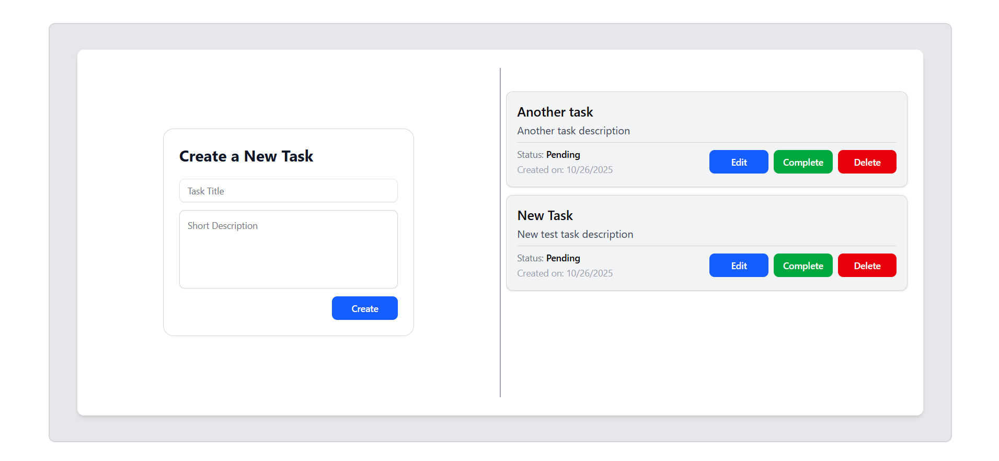
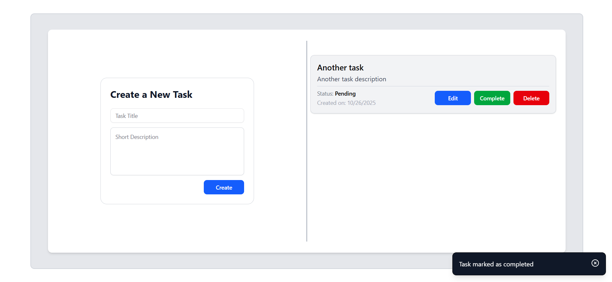

<div align="center">
  <h1="center">PERN TAsk Tracking Application</h1>
</div>




### This project is a fullstack Todo web application developed as part of a Full Stack Engineer take-home assessment. The application focuses on providing a simple, functional, and secure task management system, with a backend REST API, a relational database, and a single-page frontend UI, all fully dockerized for easy setup and testing.

### Key features include creating and managing todo tasks, marking tasks as completed, listing only the most recent tasks, and filtering tasks based on completion status. The application ensures robust data validation with proper response codes and error handling. The backend is designed following clean code principles for maintainability, while the frontend provides a simple and responsive single-page interface for easy task management.

### The application follows a modular architecture with clear separation of concerns, leveraging a fullstack JavaScript stack for scalability and maintainability. It implements a RESTful API for managing tasks with robust data validation and proper response handling. The project is fully dockerized for easy setup and provides a clean, structured codebase that demonstrates best practices in backend and frontend development.

### The project includes structured environment configuration for both development and production and is Docker-ready for easy deployment. Future improvements could include enhancing the frontend-backend interactions and expanding the user management system with full login/signup functionality, as well as implementing robust user authentication and authorization processes.

### Built with

- [![React][React.js]][React-url]
- [![Vite][Vite.js]][Vite-url]
- [![TailwindCss][TailwindCss]][Tailwind-url]
- [![Node][Node.js]][Node-url]
- [![Express][Express.js]][Express.js-url]
- [![Sequelize][Sequelize]][Sequelize-url]
- [![PostgreSQL][PostgreSQL]][PostgreSQL-url]
- [![Jest][Jest]][Jest-url]
- [![Docker][Docker]][Docker-url]

## Getting started

### Prerequisites

- Docker: [Docker download page](https://www.docker.com/products/docker-desktop/)

### Installation

1. Clone the repo
   ```bash
   git clone https://github.com/CharakaJith/fullstack-todo-assessment.git
   ```
2. Step into the project
   ```bash
   cd fullstack-todo-assessment
   ```

### Environment variables setup

#### Server side

1. Create a `.env` file in root folder
   ```
   New-Item -Path . -Name ".env" -ItemType "File"
   ```
2. Open the `.env` file and update the variables

   ```
   ## environment variables
   ENV=development
   PORT=8000

   ## database configurations
   PG_USER=<username>
   PG_PASSWORD=<password>
   PG_HOST=<db>
   PG_DATABASE=<fullstack_todo>
   PG_MAXCONN=150

   ## client url
   FRONTEND_URL=http://localhost:3000
   ```

#### Client side

1. Create a `.env` file in the client folder
   ```
   New-Item -Path . -Name ".env" -ItemType "File"
   ```
2. Open the `.env` file and update the variables

   ```
   ## base url
   VITE_API_BASE_URL=http://backend:8000
   ```

### Start the project using Docker (recommended)

1. Build the Docker containers (optional: `--no-cache` for a fresh build):
   ```bash
   docker compose build
   #or
   docker compose build --no-cache
   ```
2. Run the containers
   ```
   docker compose up
   ```
3. Stop and remove running containers
   ```bash
   docker compose down
   ```
4. Remove volumes and orphaned containers (optional)
   ```
   docker compose down --volumes --remove-orphans
   ```
5. Access the application
   ```
   Frontend: [Frontend Url](http://localhost:3000)
   Backend API: [Backend API Url](http://localhost:8000/api)
   ```

### Declaration

- This project, including all source code and documentation, was developed by me as part of the Aeontrix AI Backend Developer technical assessment.
- ChatGPT was used as a guidance for UI component styling (CSS) and layout decisions. All backend functionality, including API implementation, database interactions, business logic, and test files as well as the thought process was independently concluded by the author.

## Contact

Email: [charaka.info@gmail.com](mailto:charaka.info@gmail.com) | LinkedIn: [Charaka Jith Gunasinghe](https://www.linkedin.com/in/charaka-gunasinghe/)

<!-- MARKDOWN LINKS & IMAGES -->

[React.js]: https://img.shields.io/badge/React-20232A?style=for-the-badge&logo=react&logoColor=61DAFB
[React-url]: https://reactjs.org/
[Vite.js]: https://img.shields.io/badge/Vite-646CFF?style=for-the-badge&logo=vite&logoColor=white
[Vite-url]: https://vite.dev
[TailwindCss]: https://img.shields.io/badge/Tailwind_CSS-06B6D4?style=for-the-badge&logo=tailwind-css&logoColor=white
[Tailwind-url]: https://tailwindcss.com/
[Node.js]: https://img.shields.io/badge/Node.js-12A952?style=for-the-badge&logo=node.js&logoColor=white
[Node-url]: https://nodejs.org/en
[Express.js]: https://img.shields.io/badge/Express.js-000000?style=for-the-badge&logo=express&logoColor=white
[Express.js-url]: https://expressjs.com/
[Sequelize]: https://img.shields.io/badge/Sequelize-52B0E7?style=for-the-badge&logo=sequelize&logoColor=white
[Sequelize-url]: https://sequelize.org/
[PostgreSQL]: https://img.shields.io/badge/PostgreSQL-336791?style=for-the-badge&logo=postgresql&logoColor=white
[PostgreSQL-url]: https://www.postgresql.org/
[Jest]: https://img.shields.io/badge/Jest-C21325?style=for-the-badge&logo=jest&logoColor=white
[Jest-url]: https://jestjs.io/
[Docker]: https://img.shields.io/badge/Docker-2496ED?style=for-the-badge&logo=docker&logoColor=white
[Docker-url]: https://www.docker.com/
